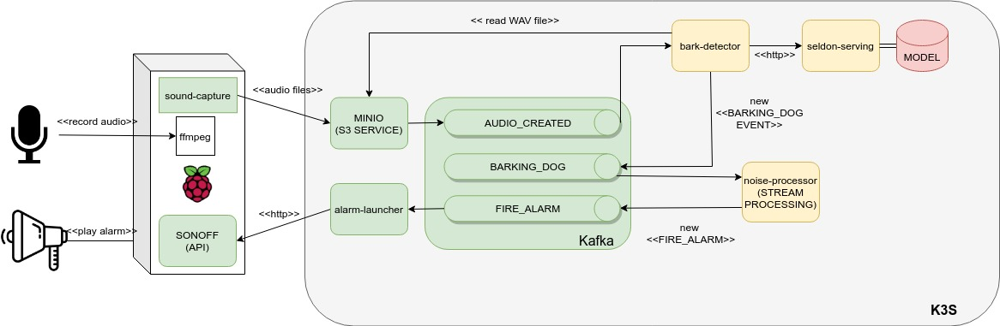

[](https://github.com/santiagocardin/barkend/actions/workflows/alarm-launcher.yaml)
[](https://github.com/santiagocardin/barkend/actions/workflows/bark-detector.yaml)
[](https://github.com/santiagocardin/barkend/actions/workflows/noise-stream-processor.yaml)

# Barkend project

The "barkend" project enables sound recording and processing continuously, identifying specific sounds and reacting to them. More specifically, the system is designed to trigger a heavy-duty alarm whenever it detects dogs barking for a duration of time.

This is a personal project built out of desperation with the hunting dogs of several neighbors. It also presented an opportunity to experiment with some technologies. 

Many thanks to Nathan Glover and his awesome article ["Dog Bark Detector"](https://devopstar.com/2020/04/13/dog-bark-detector-machine-learning-model) which has been a great inspiration.

## Architecture



Components are organized like this:

```
|- barkend
   |- barkend-alarm-launcher            (k8s micro service)
   |- barkend-bark-detector             (k8s micro service)
   |- barkend-noise-stream-processor    (k8s micro service)
   |- barkend-ml-serving                (k8s ML serving service)
   |- barkend-ml-training               (Keras ML training)   
   |- barkend-sound-capture             (Raspberry Pi scripts)

```

All services are deployed via helm charts.

## Hardware

TODO...

## Provision

A local development cluster can be started using the provided _Vagrantfile_:

```shell
$ vagrant up
```

Kafka and MinIO services will be provided.

## Build

In order to build the three Java microservices you need to run:

```shell
$ mvn clean package
```

## Deploy

Each service can be deployed to the kubernetes cluster using the following command:

```shell
$ skaffold run
```
